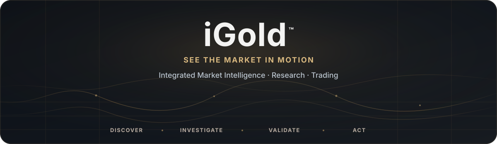
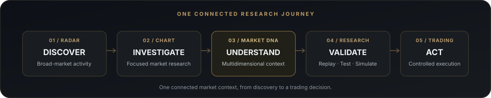
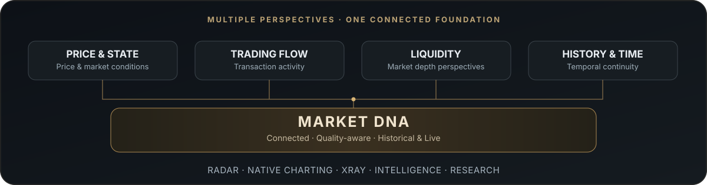
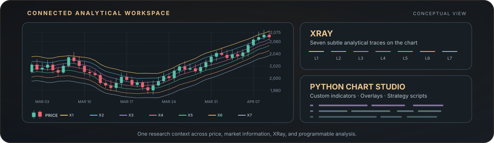

  

**An integrated environment for discovering market activity, understanding its structure, researching strategies, and connecting analysis to trading.**

*Market-wide discovery · Multidimensional intelligence · Python-powered research · Connected execution*

 

## Why iGold Exists

Every day, the crypto market's biggest gainers and losers draw attention to assets that have made extraordinary moves over the preceding 24 hours. Yet by the time an asset reaches the top or bottom of those rankings, a substantial part of its movement may already have unfolded.

The more consequential question is what happened **before** that movement became obvious: how did market activity change, what conditions accompanied it, and which developing behaviors might have warranted closer investigation?

Answering that question across hundreds of assets demands more than an occasional look at a price chart. It calls for continuous market-wide observation, connected historical and live information, multiple analytical perspectives, and a way to direct deeper research toward the assets that merit attention.

**iGold is designed around that challenge: discovering developing market activity, investigating its underlying context, and connecting research to informed trading decisions.**

 

# The iGold Idea

iGold is an **integrated crypto market intelligence, research, and trading platform**. Its purpose is to make broad-market monitoring, focused investigation, quantitative research, strategy validation, and exchange-connected trading parts of one coherent experience.

The platform brings together a market-wide Radar, a shared **Market DNA** information foundation, native multidimensional charting, **XRay** data visualization, specialized analytical intelligence, a Python-based environment for chart indicators and strategy scripting, historical replay and simulation, and connected trading workflows.

These are connected parts of a larger analytical process, not isolated tools.

> **Discover meaningful activity. Understand its context. Develop and validate an idea. Move toward execution without losing the research behind it.**

 

# One Platform. The Full Market Research Journey.

| Experience | What it enables |
|---|---|
| **Discover — Market Radar** | Monitor broad market activity and develop a dynamic shortlist of assets worth investigating. |
| **Investigate — Native Multidimensional Charting** | Study price, historical context, custom indicators, analytical overlays, and market information in an independent charting environment. |
| **Understand — Market DNA, XRay & Analytical Intelligence** | Explore connected data perspectives, market behavior, and findings from complementary analytical models. |
| **Validate — Python Chart Studio, Time Machine & Simulator** | Build chart-native indicators and strategy scripts, replay historical conditions, backtest hypotheses, and compare scenarios. |
| **Act — Connected Trading** | Carry research into exchange-linked account, position, and controlled execution workflows. |

The experience is designed to preserve context as attention moves from the wider market to a specific asset, a research hypothesis, and a potential trading decision.

 

# Market Radar — From Broad Observation to Focused Research

Markets can contain hundreds of instruments, but only a subset will be relevant to a particular investigation at any given moment.

**Market Radar** is designed to observe the broader market across multiple time horizons, surface activity that warrants closer examination, and organize selected assets into dynamic research watchlists. Its role is to help direct attention and deeper analytical resources where they are most useful.

A Radar result is the **beginning of an investigation**: a candidate for research, not a guaranteed signal or a prediction of the next market move.

 

# Market DNA — A Connected Information Foundation

Price alone cannot describe every dimension of market behavior. Price and market state, trading activity, liquidity, temporal context, and historical information provide complementary views of what is happening.

**Market DNA** is the shared information foundation of iGold. Designed to support both live observation and historical investigation, it connects multiple market-data perspectives while treating data availability, quality, and continuity as integral to research.

Its local-first architecture is intended to support efficient management of substantial historical information and keep different analytical experiences grounded in a common data context.

 

# Native Multidimensional Charting & XRay

The iGold charting environment is designed as an **independent analytical workspace**, not merely a display for price candles.

It brings price action and historical context together with synchronized Market DNA perspectives, specialized analytical output, technical indicators, programmable overlays, and strategy-driven annotations.

**XRay** extends this workspace with explorable views of the underlying market-data layers, helping researchers examine conditions that may not be visible in price action alone.

The result is a connected space for investigating both **how a market moves and the information surrounding that movement**.

 

# Multidimensional Market Intelligence

Market behavior unfolds across interrelated dimensions. Momentum, temporal context, trading activity, liquidity, and other analytical perspectives can contribute different insights into a developing move.

iGold is designed to bring specialized analytical capabilities together in a coherent research experience. Rather than reducing a complex market to one isolated measurement, it provides a foundation for examining multiple sources of evidence, their relationships, and possible market scenarios.

Its proprietary analytical methods are not part of this public repository.

 

# Python-Powered Indicators, Research & Strategy Validation

The iGold research environment is designed to let users create their own analytical instruments and evaluate trading ideas within the same platform.

<table>
<tr>
<td width="50%" valign="top">

### Python Chart Studio

Develop Python-based **custom technical indicators**, analytical overlays, market visualizations, and strategy scripts. Display their outputs in the native charting workspace and connect custom analysis to the platform's market-data foundation.

</td>
<td width="50%" valign="top">

### Time Machine

Revisit historical market conditions through a replay-oriented research experience. Examine how an asset and its surrounding market context evolved before, during, and after a particular period.

</td>
</tr>
<tr>
<td width="50%" valign="top">

### Simulator & Backtesting

Test hypotheses, investigate historical strategy behavior, compare scenarios, and examine results before applying a strategy to live market conditions.

</td>
<td width="50%" valign="top">

### Connected Trading

Extend the research workflow to exchange connectivity, account and position management, order execution, and controlled manual or automated trading.

</td>
</tr>
</table>

 

# Product Directions

The iGold product vision connects four major areas into one developing platform.

| Direction | Product focus |
|---|---|
| **01 · Market Foundation** | Live and historical Market DNA, efficient information management, quality and continuity, and independent multidimensional charting. |
| **02 · Discovery & Intelligence** | Market-wide Radar, dynamic watchlists, focused analysis, complementary analytical models, and XRay. |
| **03 · Research & Validation** | Python Chart Studio, chart-native indicators and overlays, strategy scripting, historical replay, backtesting, and simulation. |
| **04 · Connected Execution** | Exchange integration, account and position workflows, and controlled manual and automated trading. |

Each direction contributes to the same research-to-execution experience. The product model is intended to remain coherent as individual capabilities evolve.

 

# Designed for a Continuous Analytical Workflow

An analyst might begin with the Radar, identify a small group of assets showing unusual activity, and move directly into a deeper examination of one candidate. Price, history, market-data layers, and analytical perspectives remain connected throughout that investigation.

The analyst can then develop a custom indicator or strategy hypothesis in Python, revisit comparable historical conditions, evaluate the idea through replay or simulation, and, when appropriate, move toward a connected trading workflow.

**The continuity of information matters as much as the individual tools.** Every stage is designed to build on the research that came before it.

 

## Product Status

**Active Product Development**

iGold is being developed toward the integrated experience described here. This public repository presents the product vision, intended capabilities, and selected high-level illustrations; availability of individual functions depends on their implementation and release.

<strong>Technology, Public Scope & Proprietary Boundary</strong>

 

### Product-Level Technology

iGold follows a local-first approach to connected live and historical market information, modular analysis, native visualization, and research workflows. Python is the intended language for its user-programmable indicators, chart overlays, and strategy scripting.

### Public Scope

This repository documents the product's purpose, user experience, conceptual capabilities, and roadmap. The underlying private implementation—including proprietary analytical models, algorithms, signal logic, internal data structures, and other non-public research—remains private.

### Research & Trading Risk

Market analysis is inherently uncertain. Screening results, analytical outputs, research tools, simulations, and automated workflows do not guarantee early detection, predictive accuracy, or profitable trades.

 

---

### Designed & Developed by [Ali Alavi](https://github.com/alaviarts)

**Product & Systems Architect**

 

**iGold™**

**© 2026 Ali Alavi. All rights reserved.**

[Proprietary License](./LICENSE.md) · [IP Notice](./NOTICE.md)

 

*See the market in motion.*

